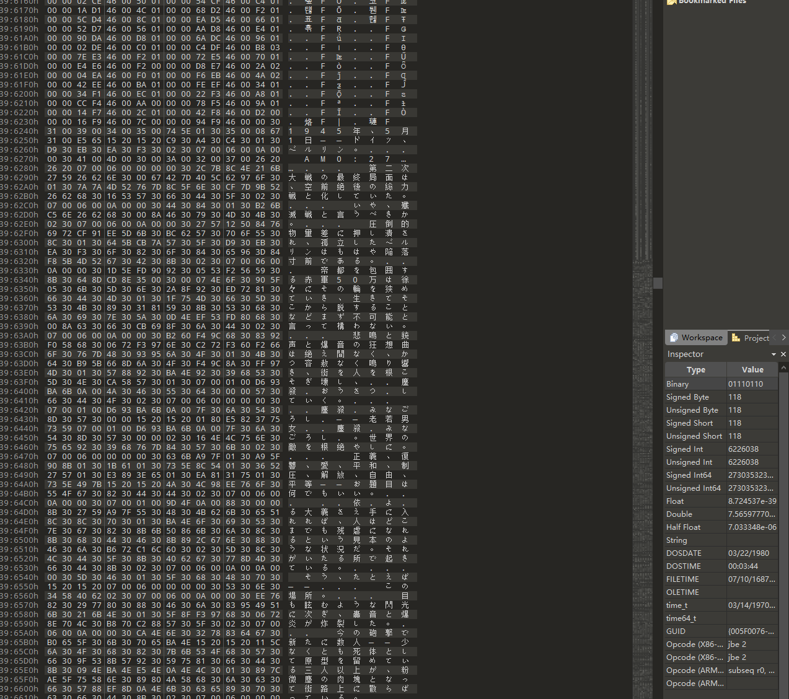
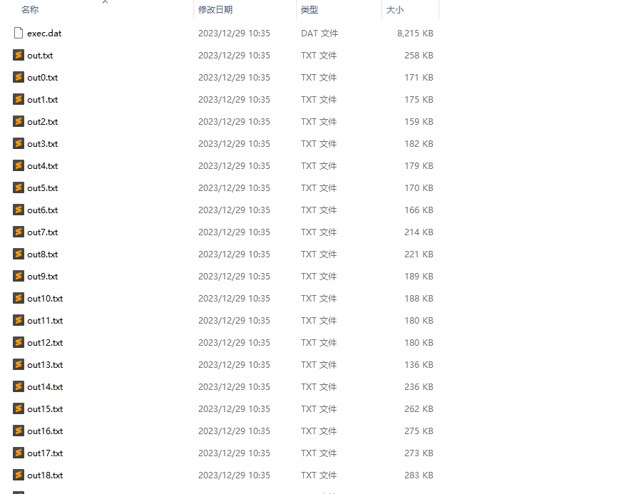
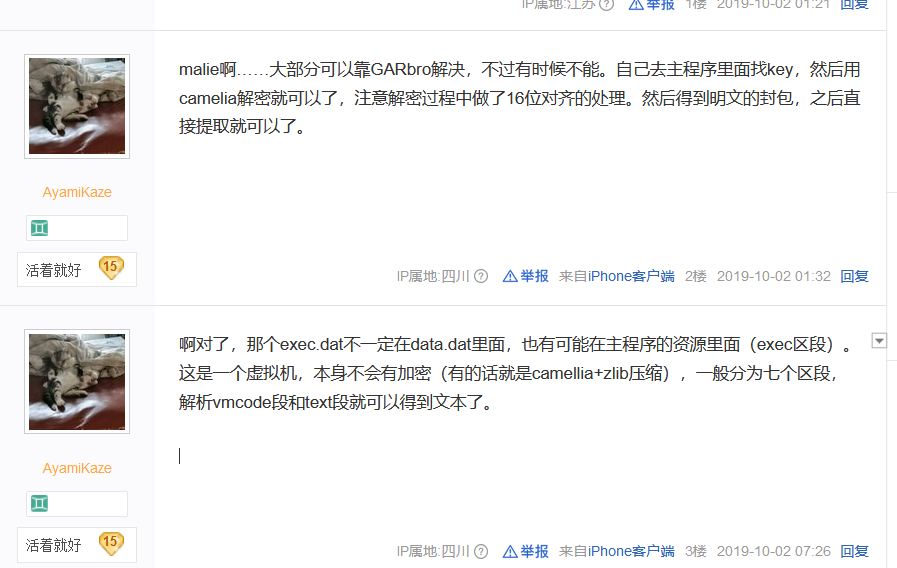
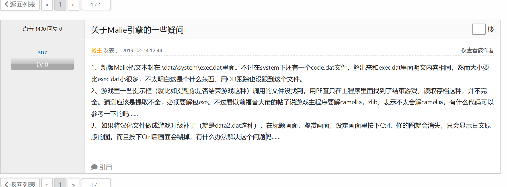
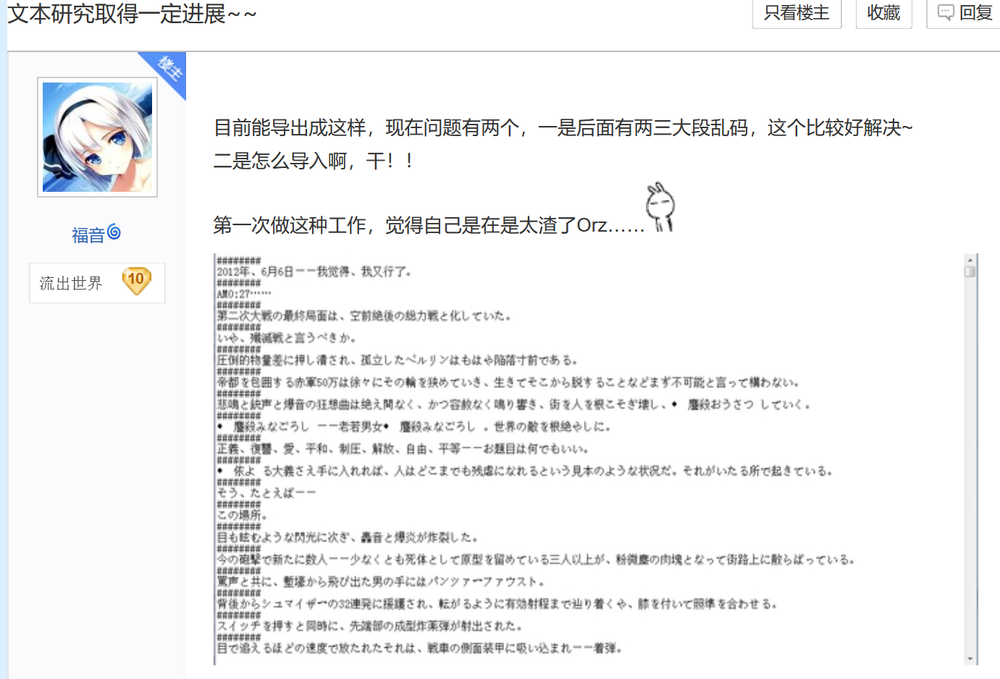
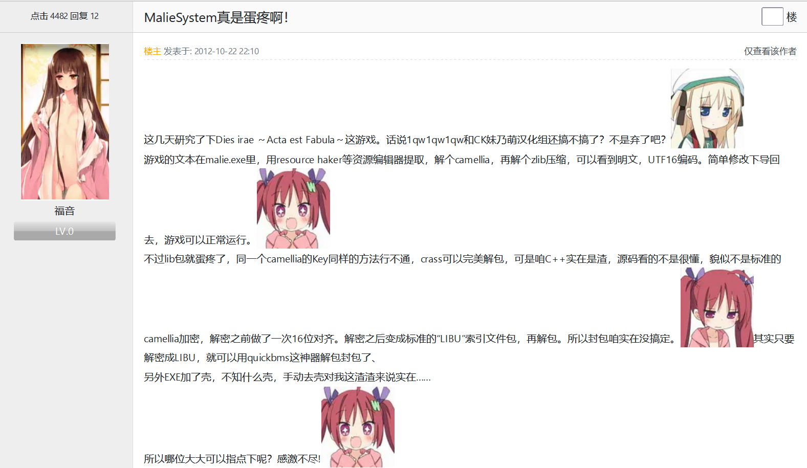
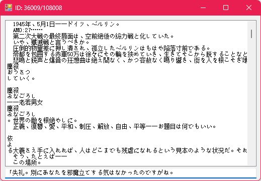
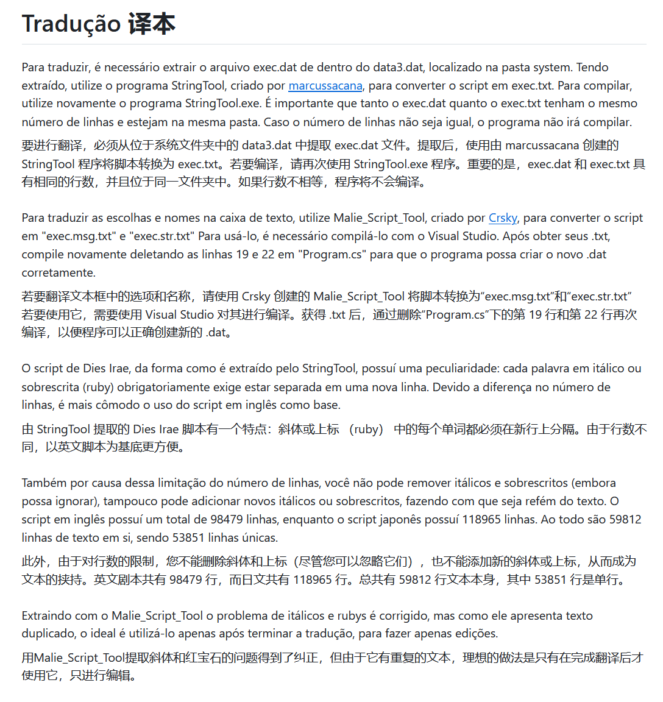

# 项目说明

本项目旨在基于Galtransl等ai翻译工具对dies irae的文本进行汉化翻译

---
Todo list
1. data文件解包，以及剧本提取 √
2. 尝试调教gpt字典，利用galtransl进行优质翻译 （并行）
3. 编写脚本替换解包剧本，并手动校错  （doing
	4. 需要分别修改剧本文本和选项文本
4. 使用工具打包exec.dat
5. 利用resource hacker整合原exe文件和exec.dat
6. 测试游戏
7. 发布补丁

---
# 汉化记录（akaruzi的碎碎念）

## 剧本解包

用garbro提取exec.dat （位置在data1.dat/system/exec.dat)

用16进制编辑器可看出，后部分是unicode的明文剧本
> 

前面部分不知道是什么编码形式的文本（可能是编译好的执行文件？）

通过dalao做的工具Light_DatExtract，直接从exec.dat提取所有文本
> 

---
## Malie System 调教参考

> [web](https://tieba.baidu.com/p/6282181656?pid=127758453020&cid=#127758453020) 
>
> camellia应该是一种加密算法，网上有在线的解密工具（对，我就是什么都不懂的fw)

相同问题
> [kdays](https://bbs2.kdays.net/read/74258)

前坑程序大佬的贴

> [dies吧](https://tieba.baidu.com/p/1959529444?red_tag=2832294380#25906979832l) 日期2012...
> 

> [kdays](https://bbs2.kdays.net/read/22545)

---

### 解决方案1（手搓十万翻译）

受大佬指点，直接将exec.dat用lsegui修改之后，用resource hacker整合启动exe文件就行。

> 
> 十万行的含金量，怪说不得填词能这么久

### 解决方案2 （巴西大佬成功救我狗命）

因为想到日语需要考虑假名注音换行问题，便去vndb翻了翻di的release条目，无意发现巴西dalao做的民间汉化，整个过程直接开源到了github上。dalao对整个汉化过程做了非常详细的说明，并且提供了可以直接解包和封包exec.dat的工具，可以直接解包dat文件得到txt，通过对txt的修改再打包回dat文件，不用坐牢手动回填了。

> [项目地址](https://github.com/Monaco-a-Knox/Dia-da-Ira)
> 
