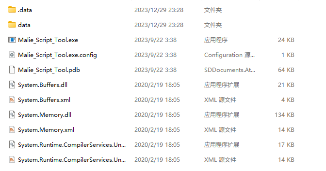
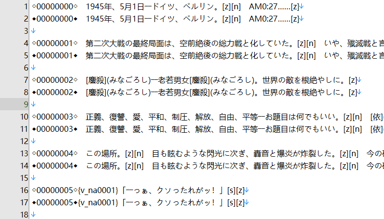
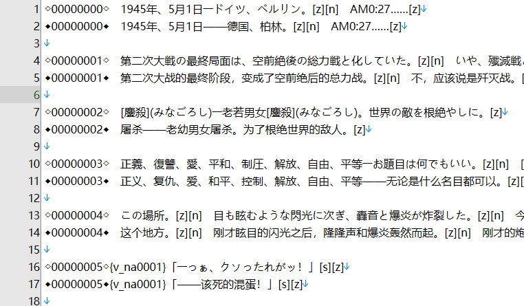
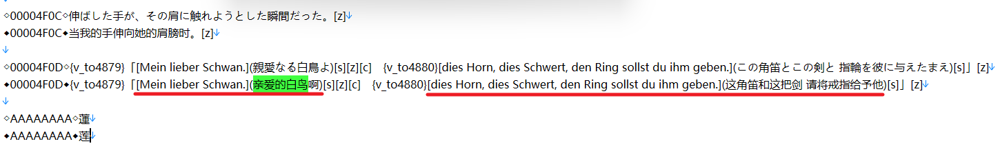

# 项目说明

本项目原旨在基于Galtransl等ai翻译工具对dies irae的文本进行汉化翻译。

---
Todo list
1. data文件解包，以及剧本提取 √
2. 尝试调教gpt字典，利用galtransl进行优质翻译 （并行）√
3. 人工校对剧本文件（doing）
4. 测试游戏
3. 发布补丁
	

# 目前进度

2023-01-10 更新：找到了愿意做校对的dalao，现在打算等完全校对后发布，后续应该会很快吧。

---

制作补丁的基本流程已经走了一遍，目前在测试，同时根据翻译情况补充一些新的词进gpt辞典。嘛，以测试者的视角来看，gpt3.5对日常剧情的文本基本上没有问题，这部分后续估计不会改动（除非有校对大佬愿意接）。吟唱部分都会人工替换，参考了DI的taiwan大佬写的文言吟唱，润色工作交给了另一位比较中二大佬。而剩下的就是等我测试完学姐线，更新辞典后再进行一次重新翻译（大概率还是gpt3.5-1106模型），大致校对一遍后就发布补丁。

补充：

参考了游戏英版DX版本的结构，打算分别做两个补丁对应aa和aef

aa版因为是全年龄版，很多cg遭到了剪裁，经过测试替换原cg就可以覆盖，补丁会默认替换。

aef版hcg会用英版的无码cg进行替换。

# 使用指北

项目做完后会发布补丁，目前还在施工阶段所以下面将重点讲如何基于原装游戏启用汉化，方便快速测试。

## 概念篇

游戏版本：DI初回是在07年，最初发布的Dies irae Also sprach Zarathustra由于还只是半成品的缘故，导致了“怒りの日事件”这起炎上事故，后续light社又补发几个版本，剧本上都有新的补充。目前DI一般泛指的是Dies irae ～Acta est Fabula～和Dies irae ~Amantes amentes~ 前者是R18版，后者是全年龄版也是steam上和任天堂上的版本。两者差别除了分级之外，后者（简称aa版）较之前者（简称aef版），补充other story 各种后日谈和前传，还有安娜end的补票以及玲爱线增加一条TE，也就是三神战结局。这个结局非常值得游玩，所以强烈建议aef版之后，一定要补aa版。说回正题，官方发行的日语版本就这俩个。light发布的英版主要也是两个版本，分别是英化aa版和DX版。前者上架了steam，共通线部分免费，每个女主的线路都需要购买单独的dlc（分割商法被light社懂完了）不用说对应的是全年龄的日版aa。而后者则是mangagamer上架的版本，里面同时封包了全年龄的aa版和R18的aef版，但系统不共用，需要分别运行对应的启动程序。

Malie engine：light社自研引擎，不开源而且处理起来比较麻烦，一定程度上影响了light社作品的汉化，好在现在有其他dalao搭好的工具，本项目也收益于此。

exec.dat：malie引擎读取剧本的封包文件，一般位置都封装在`data1.dat/data/system/`路径下，好像部分light社的老游戏会封装在malie.exe里，具体不做详细讨论。DI的日版都放在data1.dat文件里，英化aa版则是data3.dat，DX版aa的exec.dat文件封包在data3.dat，而aef则是在data4.dat里。

## 工具篇（解包封包）

### Garbro

Garbro是一款开源且广受好评的galgame解包工具，可以直接在github上找到，我也打包在了本仓库的tools目录。

DI是基于malie引擎，这个引擎会按顺序读取malie.exe的封包文件（如果有），然后是目录下的data文件夹或者是data.dat封包文件。我们可以通过garbro解包data1.dat（exec.dat存在的封包文件，英版则不同），可以得到一个data文件夹，将其放置于游戏根目录，并把其中的exec.dat替换成我们翻译后的exec.dat文件，将原data1.dat文件删掉或者放到非根目录下后，启动游戏后就会读取新的exec.dat文件，也就是汉化启动了。

### Malie_Script_Tool

Malie_Script_Tool是大佬[crskycode](https://github.com/crskycode/Malie_Script_Tool)开源的malie引擎处理工具，本项目直接使用了巴西大佬[Monaco-a-Knox](https://github.com/Monaco-a-Knox/Dia-da-Ira)翻译DI的项目下编译好的工具。

本项目根目录compiler\Malie_Script_Tool下分别有两个文件夹，compilar和decompilar对应封包工具和解包工具。使用操作都大差不差，先以解包为例，进入对应的Debug文件夹

Malie_Script_Tool.exe是运行解包的程序，我们只需要将exec.dat文件放到data/system文件夹，运行程序会自动生成解包剧本文件，exec.msg.txt和exec.str.txt 前者是文本剧本，也是主要翻译的施工地。后者是演出调用剧本，选项文本在里面，其他都是图片或者语音文件的调用。

然后是封包，将exec.msg.txt和exec.str.txt回封成exec.dat。解包一样将修改好的exec.msg.txt于exec.str.txt放置于data/system文件夹，然后确保目录下有一个exec.org.dat的文件。这个dat文件必须是你解包出两个剧本文件的原exec.dat重命名后的文件，而且翻译后的剧本文件(exec.msg.txt和exec.str.txt)的行数不能增加或减少，因为内存地址已经具体分配了。运行程序之后，在Debug/.data/system目录下会生成修改后的exec.dat文件，封包的工作就完成了。

**需要注意的是**日版和英版的exec.dat解包的剧本不能一一对应，英版的剧本内容大体上相近，但有其中的一些句子被做了分解甚至添加了新的句子，所以行数不等同。这也是汉化的一个问题，简单来说不能直接把基于日版的翻译替换到英版上，需要手动挨个微调剧本结构做成相同的行数，有一定的工作量。

## 翻译篇

如前言所说，我们需要做的主要工作是把剧本文件exec.msg.txt汉化，然后再封回exec.dat。那我们该如何修改剧本呢？

剧本文件的基本结构是以双行文本以及一个空行为基本的组合排列，每行开头为文本对应的内存地址，后面为正常文本。而文本也不是单纯的文字，其中夹杂了一些由方括号或花括号包围的字符串，这是malie引擎使用的指示符，效果是换行以及语音调用等。这部分建议保留，删掉后可能导致封包失败。我们需要做的事翻译第二行，并保留指示符。

游戏几乎所有的吟唱和一些外来词都采用了注音的方式标注，语法跟markdown的超链接相同`[原文](注音)`，这部分都建议保留并翻译注音部分。

**注意事项**：原文第一行都不要改动。不要改变行数，保持与最初的解包剧本的一致。不然都有可能导致封包不能

### 基于英版翻译

DI是一款日式adv视觉小说，因此本篇最开始基于的汉化文本为日语，出于文本准确度的考虑我仅使用galtrans翻译了日语版剧本。而如果需要基于英语汉化，需要手动调节原剧本达到与英版的对应。

> 

