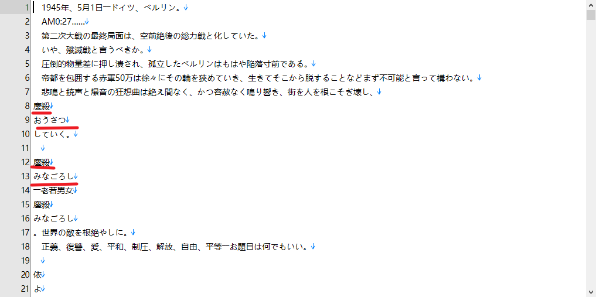
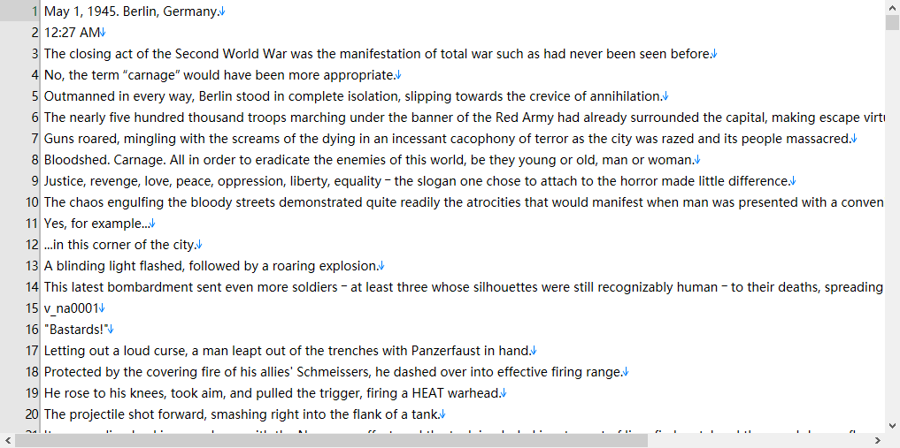
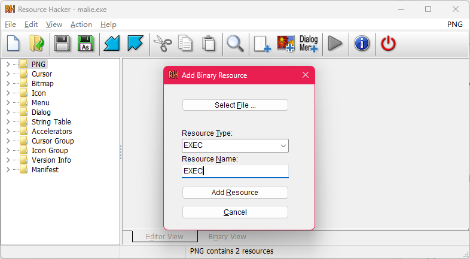
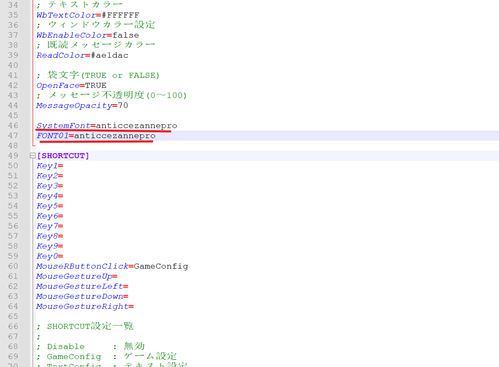

# 项目说明

本项目原旨在基于Galtransl等ai翻译工具对dies irae的文本进行汉化翻译。

di的汉化项目现已从原坑主接过手了，ai翻译的补丁大概率不会发布。这个仓库将保留下来，希望能对其他想汉化基于malie system游戏的坑友提供些许启发。

---
目前进度：steam版前五章完成，后续会更新到香纯线和前两个ot（steam免费版的所有内容）

# 使用指北

## 概念篇

- 游戏版本：DI初回是在07年，最初发布的Dies irae Also sprach Zarathustra由于还只是半成品的缘故，导致了“怒りの日事件”这起炎上事故，后续light社又补发几个版本，剧本上都有新的补充。目前DI一般泛指的是Dies irae ～Acta est Fabula～和Dies irae ~ Amantes amentes ~ 前者是R18版，后者是全年龄版也是steam上和任天堂上的版本。两者差别除了分级之外，后者（简称aa版）较之前者（简称aef版），补充other story 各种后日谈和前传，还有安娜end的补票以及玲爱线增加一条TE，也就是三神战结局。这个结局非常值得游玩，所以强烈建议aef版之后，一定要补aa版。说回正题，官方发行的日语版本就这俩个。light发布的英版主要也是两个版本，分别是英化aa版和DX版。前者上架了steam，共通线部分免费，每个女主的线路都需要购买单独的dlc（分割商法被light社懂完了）不用说对应的是全年龄的日版aa。而后者则是mangagamer上架的版本，里面同时封包了全年龄的aa版和R18的aef版，但系统不共用，需要分别运行对应的启动程序。

- Malie engine：light社自研引擎，不开源而且处理起来比较麻烦，一定程度上影响了light社作品的汉化，好在现在有其他坑友搭好的工具，本项目也收益于此。

- exec.dat：malie引擎读取剧本的封包文件，一般位置都封装在`data1.dat/data/system/`路径下，好像部分light社的老游戏会封装在malie.exe里，具体不做详细讨论。DI的日版都放在data1.dat文件里，英化aa版则是data3.dat，DX版aa的exec.dat文件封包在data3.dat，而aef则是在data4.dat里。

## 工具篇（解包封包）

### Garbro

Garbro是一款开源且广受好评的galgame解包工具，可以直接在github上找到，我也打包在了本仓库的tools目录。

- DI是基于malie引擎，这个引擎会按照数字大到小顺序读取malie.exe的封包文件（如:data4.dat > data3.dat > data2.dat），然后是目录下的data文件夹或者是data.dat封包文件。我们可以通过garbro解包data1.dat（exec.dat存在的封包文件，英版则不同），得到一个data文件夹，将其放置于游戏根目录，并替换exec.dat成处理后的exec.dat文件，删掉原data1.dat文件或者放到非根目录下后，运行malie.exe后就会读取新的exec.dat文件，也就是汉化启动了。

### Malie_Script_Tool

Malie_Script_Tool是[crskycode](https://github.com/crskycode/Malie_Script_Tool)开源的malie引擎处理工具，本项目直接使用了同在翻译di的巴西哥[Monaco-a-Knox](https://github.com/Monaco-a-Knox/Dia-da-Ira)项目下编译好的工具。

- compiler\Malie_Script_Tool下分别有两个文件夹，compilar和decompilar对应封包工具和解包工具。使用操作都大差不差，先以解包为例，进入对应的Debug文件夹。Malie_Script_Tool.exe是运行解包的程序，只需要将exec.dat文件放到data/system文件夹，运行程序会自动生成解包剧本文件，exec.msg.txt和exec.str.txt 前者是文本剧本，后者是演出调用剧本（包括选项和人名）。

- 封包：将基于同一个exec.dat解出来的exec.msg.txt和exec.str.txt回封。同解包一样将修改好的exec.msg.txt于exec.str.txt放置于data/system文件夹，然后确保目录下有一个exec.org.dat的文件。这个dat文件必须是你解包出两个剧本文件的原exec.dat重命名后的文件，而且翻译后的剧本文件(exec.msg.txt和exec.str.txt)的行数不能增加或减少，因为内存地址已经被具体分配。运行程序之后，在Debug/.data/system目录下会生成修改后的exec.dat文件。如果没有报错，okay，封包完成。

- **需要注意的是**日版和英版的exec.dat解包的剧本不能一一对应，英版的剧本内容大体上相近，但有其中的一些句子被做了分解甚至添加了新的句子，所以行数不等同。这也是汉化的一个问题，简单来说不能直接把基于日版的翻译替换到英版上，需要手动挨个微调剧本结构做成相同的行数，有一定的工作量。

### String_Tool

这个工具同样采用来自巴西哥[Monaco-a-Knox](https://github.com/Monaco-a-Knox/Dia-da-Ira)的项目下的编译版本，原项目为[SacanaWrapper](https://github.com/marcussacana/SacanaWrapper)。同样支持解封包，但跟前者解包文本差距很大。

- 解包：直接将exec.dat文件扔给StringTool.exe，会在当前目录生成对应的exec.txt（对文件名字没有要求）

- 封包：确定目录下有原exec.dat文件，将修改后的exec.txt丢给StringTool.exe，会在目录下生成一个exec_New.dat文件。同时也必须保证修改后的exec.txt行数跟原解包出的文件行数一致，不然会封包不能。

- exec.txt的文件结构相对简单，只有一行文本，原本的标识符都直接替换成了换行符，但其中也包括了注音。所以基于日语版进行汉化会非常受限于文本（除了吟唱，还有非常多的假名注音）而英版则是只保留了吟唱部分的拉丁语注音，数量比较小可以手动调节。建议英语版工作流基于此工具。

### Resource Hacker

Resource Hacker是一款可用于解包和封装exe的开源软件，github上也能直接找到。我们需要用resource hacker来打包exec.dat进exe程序制作汉化补丁。

- 根据目前的测试，Malie system对于剧本文件的读取优先顺序是这样的： exe封装EXEC文件 > 根目录下data.dat原封包文件 > 根目录下data文件夹，所以为了在保留原有文件的前提下，覆盖掉剧本文件的做法是将exec.dat封装进malie.exe
- 用resource hacker打开exe文件后，点击添加二进制资源文件，把类型名字都设置为EXEC，选择翻译后的exec.dat文件即可。

- 到这一步汉化补丁的制作就算完工了，但直接运行的话游戏会使用自带的日文字体，大概率乱码。所以剩下的就是提供中文字体让malie调用。经过测试调用顺序为：封包资源文件 > 根目录下data文件夹 malie.ini规定了调用的字体名。更改成其他字体名后，malie在封包里找不到字体文件就会调用在根目录下data/font/里的字体。

- 字体的格式必须是otf，个人推荐对日语和中文兼容性都比较好的LXGW WenKai（霞鹜文楷）

## 翻译篇

### 基于日版翻译

推荐使用malie_script_tool进行翻译

- 剧本文件的基本结构是以双行文本以及空行构成组合排列，每行开头为文本对应的内存地址，后面为正常文本。其中有夹杂一些由方括号或花括号包围的字符串，这是malie引擎使用的指示符，效果是换行以及语音调用等。我们只需要翻译第二行即可，标识符可以更改，不影响封包。

- 游戏内几乎所有的吟唱和部分外来词都采用了注音的方式标注，语法跟markdown的超链接相同`[原文](注音)`，可以自行添加不会影响封包。

- 补充：不更改内存地址和行数一般都能正常封包

### 基于英版翻译

- 出于文本准确度的考虑我仅使用galtrans翻译了日语版剧本。而如果需要基于英语汉化，需要手动调节原剧本达到与英版的对应，构建字典进行集体替换。

- 由于英语版去掉了大部分令人折磨的注音，所以可以使用String_tool进行处理，以省去保留标识符带来的麻烦，部分有注音的吟唱需要手动校对。比较好的工作流是string_tool修改大部分内容，封包后再用malie_script_tools解包处理吟唱。

> 
