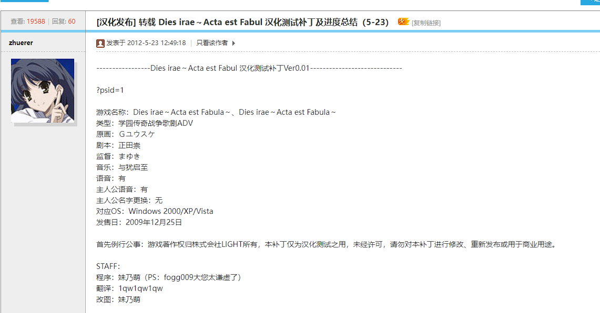
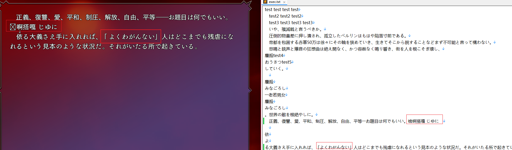
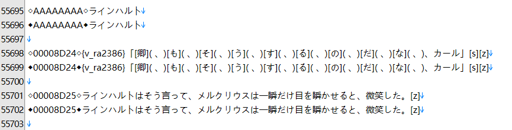

# 项目说明

本项目旨在基于Galtransl等ai翻译工具对dies irae的文本进行汉化翻译

---
Todo list
1. data文件解包，以及剧本提取 √
2. 尝试调教gpt字典，利用galtransl进行优质翻译 （并行）
3. 编写脚本替换解包剧本，并手动校错  （doing
	4. 需要分别修改剧本文本和选项文本
4. 使用工具打包exec.dat
5. 利用resource hacker整合原exe文件和exec.dat
6. 测试游戏
7. 发布补丁

---
# 汉化记录（akaruzi的碎碎念）

## 剧本解包

用garbro提取exec.dat （位置在data1.dat/system/exec.dat)

用16进制编辑器可看出，后部分是unicode的明文剧本
> 

前面部分不知道是什么编码形式的文本（可能是编译好的执行文件？）

通过dalao做的工具Light_DatExtract，直接从exec.dat提取所有文本
> 


---
## Malie System 调教参考

> [web](https://tieba.baidu.com/p/6282181656?pid=127758453020&cid=#127758453020) 
>
> camellia应该是一种加密算法，网上有在线的解密工具（对，我就是什么都不懂的fw)

相同问题
> [kdays](https://bbs2.kdays.net/read/74258)

前坑程序大佬的贴

> [dies吧](https://tieba.baidu.com/p/1959529444?red_tag=2832294380#25906979832l) 日期2012...
> 

> [kdays](https://bbs2.kdays.net/read/22545)

[星空论坛的帖子](https://bbs2.seikuu.com/thread-97030-1-1.html)

> 
>
> 帖子下有放补丁的链接，但都年久失效了...


### 解决方案1（手搓十万翻译）

受大佬指点，直接将exec.dat用lsegui修改之后，用resource hacker整合启动exe文件就行。

> 
> 十万行的含金量，怪说不得填词能这么久

### 解决方案2 （巴西大佬成功救我狗命）

因为想到日语需要考虑假名注音换行问题，便去vndb翻了翻di的release条目，无意发现巴西dalao做的民间汉化，整个过程直接开源到了github上。dalao对整个汉化过程做了非常详细的说明，并且提供了可以直接解包和封包exec.dat的工具，可以直接解包dat文件得到txt，通过对txt的修改再打包回dat文件，不用坐牢手动回填了。

> [项目地址](https://github.com/Monaco-a-Knox/Dia-da-Ira)
> 

---

### 方案2测试

1. 不改变行数更改文本

> 


结果上可行，后期需要对游戏进行测试


---


## 最终方案

因为malie system的解析起来异常麻烦，根据巴西大佬的说法，如果回封的剧本在行数上与之前的脚本不同，会封包不能。其中也包括了斜体，假名注音这种情况，都不建议修改（目前没试过会不会报错，但估计会出问题。



尤其是假名注音，因为数量太多不可能进行手动修改，当把带有[.*]这种形式的句子喂给gpt时必会报错，导致了基于日语版的翻译很难完成。


### 基于英版的汉化

相对于日版，英版几乎没有了假名注音这个问题，反而

---

Malie_script_tool 可以更改注音，但行数固定，因为内春地址有限


Todo：

1. 润色吟唱，寻找漏翻
2. 尝试更改cg，以及图片调用


```
吟唱摘录


1. 莲
ori: [時よ止まれ](Verweile doch)[おまえは美しい](Du bist so schön)
en: [Halt, O time](Verweile doch)―[z][For thou art fair.](Du bist so schön)[z]
gpt3.5:时光停驻，你是如此美丽
润色:

2.玛丽

ori:[Die Sonne toent nach alter Weise In Brudersphaeren Wettgesang.](日は古より変わらず星と競い)[s][z][c]　{v_ma3170}[Und ihre vorgeschriebne Reise Vollendet sie mit Donnergang.](定められた道を雷鳴のごとく疾走する)[s]」[z][n][n][z][n][n]{v_ma3171}「[Und schnell und begreiflich schnell In ewig schnellem Sphaerenlauf.](そして速く 何より速く 永劫の円環を駆け抜けよう)」「[Da flammt ein blitzendes Verheeren Dem Pfade vor des Donnerschlags;](光となって破壊しろ その一撃で燃やし尽くせ)」「[Da keiner dich ergruenden mag, Und alle deinen hohen Werke](そは誰も知らず 届かぬ 至高の創造)[s][z][c]　{v_ma3174}[Sind herrlich wie am ersten Tag.](我が渇望こそが原初の荘厳)[s]」「[Briah](創造)――」「[Eine Faust](美麗刹那)――」「[Ouvertüre](序曲)」

en:[Die Sonne tönt nach alter Weise in Brudersphären Wettgesang.](The Sun, since time immemorial, his brother-stars in song had rivaled)[s][z][c]{v_rn6591}[Und ihre vorgeschriebne Reise vollendet sie mit Donnergang.](Bolting 'long a path predestined, with thunder echoing in his wake)[s]"[Und schnell und unbegreiflich schnelle in ewig schnellem Sphärenlau](And with swiftness — swiftness beyond measure — his perpetual cycle fought)[s][z][c]{v_rn6593}[Da flammt ein blitzendes Verheeren Dem Pfade vor des Donnerschlags;](His path ravaged, to ashes scorched)"[Da keiner dich ergruenden mag, Und alle deinen hohen Werke"](Unknown, peerless supremacy, by heav'ns wrought)[s][z][c]{v_rn6595}["Sind herrlich wie am ersten Tag.](Equal in beauty to the first of your days.)[s]""[Beri'ah](Creation Figment)—""[Eine Faust](Ephemeral Moment)――Ouvertüre!"

gpt3.5:「[Die Sonne toent nach alter Weise In Brudersphaeren Wettgesang.](白天自古以来一直与星竞争)[s][z][c]　{v_ma3170}[Und ihre vorgeschriebne Reise Vollendet sie mit Donnergang.](如雷鸣般地疾驰在既定之路上)[s]」[z][n][n]][n][n]{v_ma3171}「[Und schnell und begreiflich schnell In ewig schnellem Sphaerenlauf.](然后快一点 比任何事都要快 永恒的循环中穿行吧)」「[Da flammt ein blitzendes Verheeren Dem Pfade vor des Donnerschlags;](成为光，将其摧毁 用一击将其燃烧殆尽)」「[Da keiner dich ergruenden mag, Und alle deinen hohen Werke](那是谁也不知道的事 无法触及 至高的创造)[s][z][c]　{v_ma3174}[Sind herrlich wie am ersten Tag.](我的渴望才是原初的庄严)[s]」「[Briah](創造)――」「[Eine Faust](美丽的瞬间)――」「[Ouvertüre](序曲)」


3.斯莱伯

ori:「[Fahr’hin,Waihalls lenchtende Welt](さらば ヴァルハラ 光輝に満ちた世界)」「[Zarfall’in Staub deine stolze Burg](聳え立つその城も 微塵となって砕けるがいい)」「[Leb’wohl, prangende Gotterpracht](さらば 栄華を誇る神々の栄光)」「[End’in Wonne, du ewig Geschlecht](神々の一族も 歓びのうちに滅ぶがいい)」「[Briah](創造)――」「[Niflheimr Fenriswolf](死世界・凶獣変生)――」

en:"[Fahr’hin, Waihalls lenchtende Welt](Farewell, brave realm of splendor; farewell, Valhalla!)"[s][z][n][n]The shattering tempest began carrying a ruinous, curse-like aria. The maddened Albedo — Wolfgang Schreiber — was unleashing his most powerful skill.[z][n][n]{v_sy2195}"[Zarfall’in Staub deine stolze Burg](Let your proud castles, towering bastions all crumble to ruin!)""[Leb’wohl, prangende Gotterpracht](Farewell, resplendent pomp of the gods — farewell!)""[End’in Wonne, du ewig Geschlecht](May you find rapture in your end, O race of immortals!)"


gpt3.5:「[Fahr’hin,Waihalls lenchtende Welt](再见。 瓦尔哈拉 充满光辉的世界)」「[Zarfall’in Staub deine stolze Burg](屹立的城池 化为微尘吧)」「[Leb’wohl, prangende Gotterpracht](再见。 夸耀着神祇的荣光)」「[End’in Wonne, du ewig Geschlecht](神祇一族也 在欢乐中毁灭吧)」「[Briah](創造)――」「[Niflheimr Fenriswolf](死世界·凶兽变生)――」


4.斯莱伯
ori:「[Vorüber, ach, vorüber! geh, wilder knochenmann!](ああ わたしは願う どうか遠くへ 死神よどうか遠くへ行ってほしい)」[s][z][n][n]　その先陣、何よりも速く応えたのは最速の[白騎士](アルベド)だった。[z][n][n]{v_sy3274}「[Ich bin noch jung, geh, Lieber! Und rühre mich nicht an.](わたしはまだ老いていない 生に溢れているのだからどうかお願い 触らないで)」「[Gib deine Hand, du schön und zart Gebild!](美しく繊細な者よ 恐れることはない 手を伸ばせ)[c][Bin Freund und komme nicht zu strafen.](我は汝の友であり 奪うために来たのではないのだから)」「[Sei guten Muts! Ich bin nicht wild,](ああ 恐れるな怖がるな 誰も汝を傷つけない)　[c][sollst sanft in meinen Armen schlafen!t](我が腕の中で愛しい者よ 永劫安らかに眠るがいい)」「[Briah](創造)――」「[Niflheimr Fenriswolf](死世界・凶獣変生)――」

en:"[Vorüber, ach, vorüber! geh, wilder knochenmann!](Ah, I plead with you, O reaper of souls, leave me be!)""[Ich bin noch jung, geh, Lieber! Und rühre mich nicht an.](Go far and touch me not, for I'm still young and warm with life's breath!)""[Gib deine Hand, du schön und zart Gebild!](Fear me not and take my hand, fair and beautiful one!)[c] [Bin Freund und komme nicht zu strafen.](I am your friend and came with no intention to harm you.)""[Sei guten Muts! Ich bin nicht wild,](Ah, there is nary a need to be afraid and startled, for no one shall hurt you.)[c][sollst sanft in meinen Armen schlafent!](May you rest in my embrace, O beloved one, and enjoy everlasting repose!)"

gpt3.5:「[Vorüber, ach, vorüber! geh, wilder knochenmann!](ああ 我希望 请让我去远方 死神啊，请去远方吧)」[s][z][n][n]　最先应答的是最快的白骑士。[z][n][n]{v_sy3274}「[Ich bin noch jung, geh, Lieber! Und rühre mich nicht an.](我还没有老去 因为我充满生命，请务必 别碰我)」「[Gib deine Hand, du schön und zart Gebild!](美丽而娇嫩的人啊 不必害怕 伸出你的手)[c][Bin Freund und komme nicht zu strafen.](我是你的朋友 我不是来夺取的)」「[Sei guten Muts! Ich bin nicht wild,](ああ 不要害怕，不要恐惧 没有人会伤害你)　[c][sollst sanft in meinen Armen schlafent!](在我的怀抱中，我的爱人啊 永远安详地入睡吧)」「[Briah](創造)――」「[Niflheimr Fenriswolf](死世界·凶兽变生)――」


5. 丽萨
ori:「[Das sich die Himmel regen Und Geist und Korper sich bewegen](天が雨を降らすのも 霊と身体が動くのも)[s][z][c]{v_rz0145}[Gott selbst hat sich zu euch geneiget Und ruft durch Boten ohne Zahl](神は自らあなたの許へ赴き 幾度となく使者でもって呼びかける)[s]」「[Auf, kommt zu meinem Liebesmahl](起きよ そして参れ 私の愛の晩餐へ)――」
gpt3.5:「[Das sich die Himmel regen Und Geist und Korper sich bewegen](天空下起雨来 灵魂和身体开始活动)[s][z][c]{v_rz0145}[Gott selbst hat sich zu euch geneiget Und ruft durch Boten ohne Zahl](神亲自前来探访你 数次使者呼唤)[s]」「[Auf, kommt zu meinem Liebesmahl](醒来吧 然后前来吧 来参加我的爱之晚餐吧)――」

6. 炮姐
ori:[Echter als er schwur keiner Eide;](彼ほど真実に誓いを守った者はなく)[c]　[treuer als er hielt keiner Verträge;](彼ほど誠実に契約を守った者もなく)[c]　[lautrer als er liebte kein andrer:](彼ほど純粋に人を愛した者はいない)」「[und doch, alle Eide, alle Verträge,](だが彼ほど 総ての誓いと総ての契約)[c]　[die treueste Liebe trog keiner wie er](総ての愛を裏切った者もまたいない)[s][z][c]　{v_en3167}[Wißt ihr, wie das ward?](汝ら それが理解できるか)[s]」[z][n][n]　[あ]( 、)[れ]( 、)[は]( 、)[戦]( 、)[争]( 、)[用]( 、)[に]( 、)[課]( 、)[し]( 、)[た]( 、)[制]( 、)[約]( 、)[に]( 、)[す]( 、)[ぎ]( 、)[な]( 、)[い]( 、)と……そう放言したエレオノーレ。ならばこれは、いったい如何なるものなのか。[z][n][n]{v_en3168}「[Das Feuer, das mich verbrennt, rein'ge vom Fluche den Ring!](我を焦がすこの炎が 総ての穢れと総ての不浄を祓い清める)」「[Ihr in der Flut löset ihn auf,und lauter bewahrt das lichte Gold,](祓いを及ぼし 穢れを流し 熔かし解放して尊きものへ)[c]　[das euch zum Unheil geraubt.](至高の黄金として輝かせよう)」[s][z][n][n]　[赤化](ルベド)は黄金を生む最終形態。ゆえにもっとも獣に近く、もっとも彼を尊崇し、その敵となる[不純物](モノ)を撃滅する剣――[z][n][n]{v_en3170}「[Denn der Götter Ende dämmert nun auf.](すでに神々の黄昏は始まったゆえに)[s][z][c]　{v_en3171}[So - werf' ich den Brand in Walhalls prangende Burg.](我はこの荘厳なるヴァルハラを燃やし尽くす者となる)[s]」「[Briah](創造)――」「[Muspellzheimr Lævateinn](焦熱世界・激痛の剣)」
gpt3.5:「[Echter als er schwur keiner Eide;](没有人能像他一样忠于誓言)[c]　[treuer als er hielt keiner Verträge;](没有人能像他一样忠于契约)[c]　[lautrer als er liebte kein andrer:](没有人能像他一样纯粹地爱着别人)」「[und doch, alle Eide, alle Verträge,](但他…… 所有的誓言和所有的契约)[c]　[die treueste Liebe trog keiner wie er](没有背叛所有的爱者)[s][z][c]　{v_en3167}[Wißt ihr, wie das ward?](汝ら 你能理解吗)[s]」[z][n][n]　埃莱奥诺莱放言说那只是为了战争而施加的限制……那么，这又是什么样的东西呢[z][n][n]{v_en3168}「[Das Feuer, das mich verbrennt, rein'ge vom Fluche den Ring!](燃烧我的这团火焰 净化和洗净一切污秽)」「[Ihr in der Flut löset ihn auf,und lauter bewahrt das lichte Gold,](施加净化 冲刷污秽 融化并释放至尊之物)[c]　[das euch zum Unheil geraubt.](让其闪耀为至高的黄金)」[s][z][n][n]　赤化是黄金诞生的最终形态。因此更接近野兽，更尊崇他，成为敌人的不纯之物将被消灭的剑——[z][n][n]{v_en3170}「[Denn der Götter Ende dämmert nun auf.](因为神祗的黄昏已经开始了)[s][z][c]　{v_en3171}[So - werf' ich den Brand in Walhalls prangende Burg.](我将成为燃尽这庄严瓦尔哈拉的存在者)[s]」「[Briah](創造)――」「[Muspellzheimr Lævateinn](灼热世界·剧痛之剑)」


7. 安娜
ori:「[In der Nacht, wo alles schläft](ものみな眠るさ夜なかに )」[s][z][n][n]　それは、声とはまた異質な響きだった。[z][n][n]{v_ru3002}「[Wie schön, den Meeresboden zu verlassen.](水底を離るることぞうれしけれ。)」[s][z][n][n]　空気ではないものを伝わって、鼓膜ではなく魂を震わせる振動。[z][n][n]{v_ru3003}「[Ich hebe den Kopf über das Wasser,](水のおもてを頭もて、)[s][z][c]　{v_ru3004}[Welch Freude, das Spiel der Wasserwellen](波立て遊ぶぞたのしけれ。)[s]」「[Durch die nun zerbrochene Stille,](澄める大気をふるわせて、)[s][z]{v_ru3006}[Rufen wir unsere Namen](互に高く呼びかわし )[s][z][c]　{v_ru3007}[Pechschwarzes Haar wirbelt im Wind](緑なす濡れ髪うちふるい……)[s]」[z][n][n]　何かが来る。俺を取り巻いていた拷問器具たちの姿は、現れた時と同じく唐突に消えていた。だが、逃げ出せない。足が駆け出すことを忘れてしまうような禍々しい歌声。[z][n]　それは瘴気。そして、妖しくも麗しい魔女の呪言。[z][n][n]{v_ru3008}「[Welch Freude, sie trocknen zu sehen. ](乾かし遊ぶぞたのしけれ！)」「[Briah](创造)―」「[Csejte Ungarn Nachtzehrer](チェイテ・ハンガリア・ナハツェーラー)」
gpt3.5:「[In der Nacht, wo alles schläft](在所有人都沉睡的夜晚里 )」[s][z][n][n]　那声音，与一般的声音完全不同。[z][n][n]{v_ru3002}「[Wie schön, den Meeresboden zu verlassen.](离开水底是多么快乐啊。)」[s][z][n][n]　传达出来的不是空气，而是震撼灵魂的振动，不是鼓膜所能感知的。[z][n][n]{v_ru3003}「[Ich hebe den Kopf über das Wasser,](将头浸入水面，)[s][z][c]　{v_ru3004}[Welch Freude, das Spiel der Wasserwellen](玩耍起波涛汹涌来多么快乐啊。)[s]」「[Durch die nun zerbrochene Stille,](使清澈的空气颤抖起来，)[s][z]{v_ru3006}[Rufen wir unsere Namen](互相高声呼唤着 )[s][z][c]　{v_ru3007}[Pechschwarzes Haar wirbelt im Wind](绿色湿漉漉的长发摇曳……)[s]」[z][n][n]　有什么东西正在接近。围绕着我的酷刑器具们突然消失得和它们出现时一样突然。但我无法逃脱。那种让我忘记奔跑的恶劣歌声。[z][n]　那是瘴气。还有，妖艳而美丽的魔女的咒语。[z][n][n]{v_ru3008}「[Welch Freude, sie trocknen zu sehen. ](让我来干燥地玩耍吧！)」「[Briah](创造)―」「[Csejte Ungarn Nachtzehrer](切特·汉加利亚·纳哈策拉)」


8. 马基那
ori:「[Tod! Sterben Einz'ge Gnade!](死よ 死の幕引きこそ唯一の救い)」[s][z][n][n]　そして、ここに究極クラスの求道がある。[z][n]　彼の渇望はすなわち終焉。その拳に触れたモノは、たとえ何者であれ物語の幕を引かれる。[z][n][n]{v_be2035}「[Die schreckliche Wunde, das Gift, ersterbe,](この 毒に穢れ 蝕まれた心臓が動きを止め)[s][z][c]　{v_be2036}[das es zernagt, erstarre das Herz!](忌まわしき 毒も 傷も 跡形もなく消え去るように)[s]」「[Das mich vergiftet, hier fliesst mein Blut:](滴り落ちる血の雫を 全身に巡る呪詛の毒を)[s][z][c]　{v_be2039}[Heraus die Waffe! Taucht eure Schwerte.](武器を執れ 剣を突き刺せ)[c]　[tief, tief  bis ans Heft!](深く 深く 柄まで通れと)[s]」「[Das mich vergiftet, hier fliesst mein Blut:](滴落的鲜血之珠 全身循环着诅咒毒素)[s][z][c]　{v_be2039}[Heraus die Waffe! Taucht eure Schwerte.](拿起武器 刺出剑)[c]　[tief, tief  bis ans Heft!](深く 深く 直到刺入把柄)[s]」「[Briah](創造)――」「[Miðgarðr Völsunga Saga](人世界・終焉変生)」
gpt3.5:「[Tod! Sterben Einz'ge Gnade!](死よ 死亡的终幕才是唯一的救赎)」[s][z][n][n]　而且，这里有着终极级别的求道。[z][n]　他的渴望即是终焉。触摸过他拳头的人，无论是谁，都将拉开故事的帷幕。[z][n][n]{v_be2035}「[Die schreckliche Wunde, das Gift, ersterbe,](この 被毒污染 腐蚀的心脏停止了跳动)[s][z][c]　{v_be2036}[das es zernagt, erstarre das Herz!](可憎的 毒も 傷も 就像消失得无影无踪)[s]」「[Das mich vergiftet, hier fliesst mein Blut:](滴り落ちる血の雫を 全身に巡る呪詛の毒を)[s][z][c]　{v_be2039}[Heraus die Waffe! Taucht eure Schwerte.](武器を執れ 剣を突き刺せ)[c]　[tief, tief  bis ans Heft!](深く 深く 柄まで通れと)[s]」「[Auf! Ihr Helden:](さあ 骑士们啊)[s][z][c]　{v_be2041}[Totet den Sunder mit seiner Qual,](罪人 连同他们的痛苦一起刺入吧)[c]　[von selbst dann leuchtet euch wohl der Gral!](至高的光芒将自然而然地 照耀在其上并降临下来)[s]」「[Briah](創造)――」「[Miðgarðr Völsunga Saga](人世界·终焉变生)」

9. 伊萨克
ori:「[Dieser Mann wohnte in den Gruften, und niemand konnte ihm keine mehr,](その男は墓に住み あらゆる者も あらゆる鎖も)[c][nicht sogar mit einer Kette, binden.](あらゆる総てをもってしても繋ぎ止めることが出来ない)」「[Er ris die Ketten auseinander und brach die Eisen auf seinen Fusen.](彼は縛鎖を千切り 枷を壊し 狂い泣き叫ぶ墓の主)[c][Niemand war stark genug, um ihn zu unterwerfen.](この世のありとあらゆるモノ総て 彼を抑える力を持たない)」「[Dann fragte ihn Jesus. Was ist Ihr Name?](ゆえ 神は問われた 貴様は何者か)」「[Es ist eine dumme Frage. Ich antworte.](愚問なり 無知蒙昧 知らぬならば答えよう)」「[Briah](創造)――」「[Gladsheimr](至高天)――[s][z]{v_mx5006}[Gullinkambi fünfte Weltall](黄金冠す第五宇宙)[s]」
gpt3.5:「[Dieser Mann wohnte in den Gruften, und niemand konnte ihm keine mehr,](那个男人住在坟墓里 所有的人 所有的锁链)[c][nicht sogar mit einer Kette, binden.](即使拥有一切也无法阻止连接)」「[Er ris die Ketten auseinander und brach die Eisen auf seinen Fusen.](他撕裂了束缚 打破了枷锁 坟墓的主人疯狂地哭泣着喊叫)[c][Niemand war stark genug, um ihn zu unterwerfen.](这个世界上所有的事物 都无法阻止他)」「[Dann fragte ihn Jesus. Was ist Ihr Name?](ゆえ 神被质问道 你到底是谁)」「[Es ist eine dumme Frage. Ich antworte.](愚蠢的问题 无知愚昧 不知道的话，我来告诉你)」「[Briah](創造)――」「[Gladsheimr](至高之境)――[s][z]{v_mx5006}[Gullinkambi fünfte Weltall](第五宇宙被黄金所覆盖)[s]」


10. 玲爱
ori:「[Auferstehn, ja auferstehn, wirst du,](蘇る そう あなたはよみがえる)[c]　[Mein Staub, nach kurzer Ruh.](私の塵は 短い安らぎの中を漂い)[c]　[Unsterblich Leben wird,](あなたの望みし永遠の命がやってくる)」「[Wieder aufzublühn wirst du gesät!](種蒔かれしあなたの命が 再びここに花を咲かせる)[c]　[Der Herr der Ernte geht](刈り入れる者が歩きまわり)[c]　[und sammelt Garben Uns ein, die starben.](我ら死者の 欠片たちを拾い集める)」「[O glaube, mein Herz, o glaube. Es geht dir nichts verloren!](おお 信ぜよわが心 おお信ぜよ 失うものは何もない)」[s][z][n][n]　ゆえに、同じく[地獄](ヴァルハラ)の住人である[大隊長](エインフェリア)らにも迷いはない。[z][n]　歓喜をもって、誇りと共に、己が世界の流出を願う。[z][n][n]{v_en2261}「[Dein ist, dein, was du gesehnt.](私のもの それは私が望んだもの)[c]　[Dein, was du geliebt, was du gestritten!](私のもの それは私が愛し戦って来たものなのだ)」「[O glaube,: du wardst nicht umsonst geboren!](おお 信ぜよ あなたは徒に生まれて来たのではないのだと)[s][z][c]　{v_sy2124}[Hast nicht umsonst gelebt, gelitten!](ただ徒に生を貪り 苦しんだのではないのだと)[s]」[z][n][n]{v_ra2227}「[Was entstanden ist, das muß vergehen.](生まれて来たものは 滅びねばならない)」[s][z][n][n]{v_mx5008}「[ Was vergangen, auferstehen!](滅び去ったものは よみがえらねばならない)」「[Hör auf zu beben!](震えおののくのをやめよ)」[s][z][n][n]{v_mx5009}「[Bereite dich zu leben!](生きるため 汝自身を用意せよ)」[s][z][n][n]{v_re2255}「[O Schmerz! du Alldurchdringer!](おお 苦しみよ 汝は全てに滲み通る)」[s][z][n][n]{v_mx5010}「[Dir bin, o Tod! du Allbezwinger, ich entrungen!](おお 死よ 全ての征服者であった汝から 今こそ私は逃れ出る)」[s][z]「[Nun bist du bezwungen!](祝えよ 今こそ汝が征服される時なのだ)」「[Atziluth](流出)――」「[Heilige Arche](壷中聖櫃)――[s][z]{v_ra2229}[Goldene Eihwaz](不死創造する)[s][z]{v_mx5011} [Swastika](生贄祭壇)[s]」
gpt3.5:「[Auferstehn, ja auferstehn, wirst du,](蘇る そう 你将重生)[c]　[Mein Staub, nach kurzer Ruh.](我的尘埃 漂浮在短暂的宁静中)[c]　[Unsterblich Leben wird,](你所期望的永恒之命即将降临)」「[Wieder aufzublühn wirst du gesät!](你所播下的命运之种 将再次在此绽放花朵)[c]　[Der Herr der Ernte geht](收割者四处徜徉)[c]　[und sammelt Garben Uns ein, die starben.](我们死者的 拾起我们的碎片)」「[O glaube, mein Herz, o glaube. Es geht dir nichts verloren!](おお 相信吧我的心 啊，请相信 没有什么可以失去的)」[s][z][n][n]　因此，同样作为地狱居民的大队长们也毫无迷惑。[z][n]　怀着欢喜，怀着自豪，祈愿自己的世界流露。[z][n][n]{v_en2261}「[Dein ist, dein, was du gesehnt.](属于我 那是我所期望的)[c]　[Dein, was du geliebt, was du gestritten!](属于我 那是我所深爱并战斗过的东西)」「[O glaube,: du wardst nicht umsonst geboren!](おお 请相信 你并非徒然而生)[s][z][c]　{v_sy2124}[Hast nicht umsonst gelebt, gelitten!](并非徒然地贪婪生命 并非徒然地受苦)[s]」[z][n][n]{v_ra2227}「[Was entstanden ist, das muß vergehen.](诞生的存在 必将毁灭)」[s][z][n][n]{v_mx5008}「[ Was vergangen, auferstehen!](已毁灭的存在 必将复苏)」「[Hör auf zu beben!](停止颤抖和恐惧吧)」[s][z][n][n]{v_mx5009}「[Bereite dich zu leben!](为了活下去 自己准备好)」[s][z][n][n]{v_re2255}「[O Schmerz! du Alldurchdringer!](おお 痛苦啊 你渗透其中的一切)」[s][z][n][n]{v_mx5010}「[Dir bin, o Tod! du Allbezwinger, ich entrungen!](おお 死よ 从曾是一切征服者的你那里 现在我逃出了)」「[Nun bist du bezwungen!](庆祝吧 现在是你被征服的时候了)」「[Atziluth](流出)――」「[Heilige Arche](壶中圣柜)――[s][z]{v_ra2229}[Goldene Eihwaz](不死创造)[s][z]{v_mx5011} [Swastika](生贽祭坛)[s]」


1.玛丽
ori: 「血、血、血、血が欲しい。ギロチンに注ごう、飲み物を。ギロチンの渇きを癒すため。欲しいのは、血、血、血」

example:血、血、血，吾欲鲜血。浇注于断头台上，甘霖饮品。为癒断头台之渴求。所欲无他，唯血、血、血


2.托里法

ori:[Mein lieber Schwan.](亲爱的白鸟啊)[s][z][c]　{v_to4419}[dies Horn, dies Schwert, den Ring sollst du ihm geben.](这角笛和这把剑 请将戒指给予他)[Dies Horn soll in Gefahr ihm Hilfe schenken,](この角笛は危険に際して救いをもたらし)[s][z][c]　{v_to4424}[in wildem Kampf dies Schwert ihm Sieg verleiht](この剣は恐怖の修羅場で勝利を与える物なれど)[s]」[z][n][n]　何が起き、何をされようとしているのか理解できない。殺す気なのか、この神父は――[z][n][n]{v_to4425}「[doch bei dem Ringe soll er mein gedenken,](この指輪はかつておまえを恥辱と苦しみから救い出した)」「[Briah](創造)――」「[der einst auch dich aus Schmach und Not befreit!](この私のことをゴットフリートが偲ぶよすがとなればいい)」「[Vanaheimr](神世界へ)――」「[Goldene Schwan Lohengrin](翔けよ黄金化する白鳥の騎士)」

gpt3.5:「[Mein lieber Schwan.](亲爱的白鸟啊)[s][z][c]　{v_to4419}[dies Horn, dies Schwert, den Ring sollst du ihm geben.](这角笛和这把剑 请将戒指给予他)[s]」「[Dies Horn soll in Gefahr ihm Hilfe schenken,](这角笛在危险时刻带来救赎)[s][z][c]　{v_to4424}[in wildem Kampf dies Schwert ihm Sieg verleiht](这剑在恐怖修罗场中赐予胜利，但)[s]」[z][n][n]　不明白发生了什么，他到底想做什么。这位神父是想要杀人吗——[z][n][n]{v_to4425}「[doch bei dem Ringe soll er mein gedenken,](这戒指曾经将你从耻辱和痛苦中拯救出来)」「[der einst auch dich aus Schmach und Not befreit!](要是我能成为戈特弗里德回忆起的遗迹就好了)」「[Briah](創造)――」「[Vanaheimr](神界)――」「[Goldene Schwan Lohengrin](飞向黄金化的白鸟骑士)」


---


ori:
gpt3.5:


ori:
gpt3.5:
ori:
gpt3.5:
ori:
gpt3.5:
ori:
gpt3.5:

```


